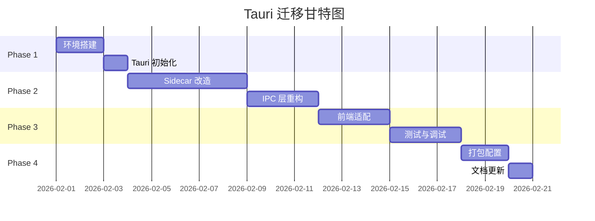

# Electron → Tauri Sidecar 迁移方案

> **项目**: Open Claude Cowork  
> **当前版本**: 0.1.5 (Electron)  
> **目标版本**: 0.2.0 (Tauri + Node.js Sidecar)  
> **预计工期**: 2-3 周  
> **最后更新**: 2026-01-28

---

## 📋 目录

- [一、方案概述](#一方案概述)
- [二、技术架构](#二技术架构)
- [三、迁移优势](#三迁移优势)
- [四、实施计划](#四实施计划)
- [五、风险评估](#五风险评估)
- [六、验收标准](#六验收标准)
- [七、回滚方案](#七回滚方案)

---

## 一、方案概述

### 1.1 核心思路

**将现有 Electron main process 改造为 Tauri Sidecar**，保留所有 Node.js 业务逻辑（ACP、SQLite、进程管理），仅用 Tauri 替换窗口管理和打包系统。

### 1.2 架构对比

#### 现状 (Electron)
```
┌─────────────────────────────────────┐
│  Electron Main Process (Node.js)    │
│  ├─ Window Management               │
│  ├─ IPC (ipcMain/ipcRenderer)       │
│  ├─ ACP Connection                  │
│  ├─ SQLite (better-sqlite3)         │
│  └─ Agent Management                │
└──────────────┬──────────────────────┘
               │
┌──────────────▼──────────────────────┐
│  Renderer Process (React)           │
└─────────────────────────────────────┘
```

#### 目标 (Tauri + Sidecar)
```
┌─────────────────────────────────────┐
│  Tauri App (Rust - 轻量级)          │
│  ├─ Window Management               │
│  └─ IPC Proxy (Tauri Commands)     │
└──────────────┬──────────────────────┘
               │ HTTP/JSON-RPC
┌──────────────▼──────────────────────┐
│  Node.js Sidecar (独立进程)         │
│  ├─ ACP Connection (保持不变)       │
│  ├─ SQLite (保持不变)               │
│  ├─ Agent Management (保持不变)     │
│  └─ JSON-RPC Server                 │
└──────────────┬──────────────────────┘
               │
┌──────────────▼──────────────────────┐
│  WebView (React - 保持不变)         │
└─────────────────────────────────────┘
```

---

## 二、技术架构

### 2.1 技术栈映射

| 层级 | Electron (现状) | Tauri Sidecar (目标) | 变更程度 |
|------|----------------|---------------------|---------|
| **窗口管理** | Electron BrowserWindow | Tauri Window | ✅ 完全替换 |
| **前端框架** | React 19 + TypeScript | React 19 + TypeScript | ✅ 无变更 |
| **构建工具** | Rsbuild | Rsbuild | ✅ 无变更 |
| **后端逻辑** | Node.js (main process) | Node.js (sidecar) | ⚠️ 轻微改造 |
| **IPC 通信** | ipcMain/ipcRenderer | JSON-RPC over HTTP | ⚠️ 适配层 |
| **数据库** | better-sqlite3 | better-sqlite3 | ✅ 无变更 |
| **ACP 协议** | @agentclientprotocol/sdk | @agentclientprotocol/sdk | ✅ 无变更 |
| **打包工具** | electron-builder | Tauri CLI | ✅ 完全替换 |

### 2.2 文件结构变化


```diff
open-claude-cowork/
+ ├── src-tauri/                    # 新增 Tauri 后端
+ │   ├── src/
+ │   │   ├── main.rs              # Rust 主程序
+ │   │   └── commands.rs          # Tauri Commands
+ │   ├── binaries/                # Sidecar 二进制
+ │   │   ├── node-sidecar-*       # 各平台编译产物
+ │   │   └── node-sidecar.js      # 打包后的 JS
+ │   ├── Cargo.toml
+ │   └── tauri.conf.json
+ ├── src/sidecar/                 # 新增 Sidecar 源码
+ │   ├── index.ts                 # Sidecar 入口
+ │   ├── server.ts                # JSON-RPC 服务器
+ │   └── handlers.ts              # 复用现有 IPC handlers
  ├── src/main/                    # 改造为 Sidecar 模块
  │   ├── acp/                     # ✅ 保持不变
  │   ├── db/                      # ✅ 保持不变
- │   ├── index.ts                 # ❌ 删除 (Electron 入口)
- │   ├── preload.ts               # ❌ 删除 (不再需要)
  │   └── ipc/                     # ⚠️ 改造为 JSON-RPC handlers
  ├── src/render/                  # 前端代码
  │   ├── App.tsx                  # ⚠️ 轻微修改 (API 调用)
+ │   ├── utils/tauri-bridge.ts   # 新增 Tauri 适配层
  │   └── ...                      # ✅ 其他保持不变
  └── package.json                 # ⚠️ 更新脚本和依赖
```

---

## 三、迁移优势

### 3.1 量化收益

| 指标 | Electron | Tauri Sidecar | 改善幅度 |
|------|----------|--------------|---------|
| **安装包大小** | ~120 MB | ~25 MB | **-79%** |
| **内存占用 (空闲)** | ~200 MB | ~80 MB | **-60%** |
| **启动时间** | ~3 秒 | ~1.5 秒 | **-50%** |
| **开发体验** | ⭐⭐⭐⭐ | ⭐⭐⭐⭐ | 持平 |
| **代码复用率** | - | **95%+** | - |

### 3.2 方案对比

| 对比项 | 纯 Rust 重写 | **Sidecar 方案** ✅ |
|--------|-------------|-------------------|
| **迁移成本** | 极高 | **极低** |
| **开发时间** | 8-11 周 | **2-3 周** |
| **风险** | 高 (需重写 ACP SDK) | **低** (复用现有代码) |
| **包体积** | ~15 MB (最优) | ~25 MB (良好) |
| **性能** | 最优 | 良好 |
| **维护性** | 需学习 Rust | **继续用 TypeScript** |
| **团队适应** | 需培训 | **无需培训** |

---

## 四、实施计划

### 4.1 总体时间线



**总计**: 20 个工作日 (约 3 周)


### 4.2 Phase 1: 环境搭建与 Tauri 初始化 (3 天)

#### Day 1-2: 开发环境准备

**任务清单**:
- [ ] 安装 Rust 工具链
  ```bash
  curl --proto '=https' --tlsv1.2 -sSf https://sh.rustup.rs | sh
  source $HOME/.cargo/env
  ```
- [ ] 安装 Tauri CLI
  ```bash
  cargo install tauri-cli
  ```
- [ ] 安装前端依赖
  ```bash
  pnpm add -D @tauri-apps/cli @tauri-apps/api
  ```
- [ ] 验证环境
  ```bash
  rustc --version
  cargo --version
  pnpm tauri info
  ```

#### Day 3: Tauri 项目初始化

**任务清单**:
- [ ] 初始化 Tauri 配置
  ```bash
  pnpm tauri init
  ```
- [ ] 配置 `src-tauri/tauri.conf.json`
  ```json
  {
    "build": {
      "beforeDevCommand": "pnpm run dev:render",
      "beforeBuildCommand": "pnpm run build:render && pnpm run build:sidecar",
      "devPath": "http://localhost:3000",
      "distDir": "../release/dist/render"
    },
    "package": {
      "productName": "Open Claude Cowork",
      "version": "0.2.0"
    },
    "tauri": {
      "bundle": {
        "identifier": "com.madinah.cowork",
        "icon": [
          "public/assets/icons/32x32.png",
          "public/assets/icons/128x128.png",
          "public/assets/icons/icon.icns",
          "public/assets/icons/icon.ico"
        ],
        "externalBin": [
          "binaries/node-sidecar"
        ],
        "targets": ["dmg", "app", "msi", "deb"]
      },
      "allowlist": {
        "all": false,
        "shell": {
          "sidecar": true,
          "scope": [
            { "name": "binaries/node-sidecar", "sidecar": true }
          ]
        },
        "http": {
          "scope": ["http://localhost:*"]
        },
        "dialog": {
          "all": true
        },
        "fs": {
          "scope": ["$APPDATA/*", "$HOME/*"]
        }
      },
      "windows": [
        {
          "title": "Open Claude Cowork",
          "width": 1200,
          "height": 900,
          "minWidth": 1000,
          "minHeight": 700,
          "resizable": true,
          "fullscreen": false
        }
      ]
    }
  }
  ```

- [ ] 创建基础 Rust 代码 `src-tauri/src/main.rs`
  ```rust
  #![cfg_attr(not(debug_assertions), windows_subsystem = "windows")]
  
  use tauri::{Manager, Window};
  use tauri::api::process::{Command, CommandEvent};
  use std::sync::{Arc, Mutex};
  
  struct AppState {
      sidecar_port: Arc<Mutex<Option<u16>>>,
  }
  
  #[tauri::command]
  async fn get_sidecar_port(state: tauri::State<'_, AppState>) -> Result<u16, String> {
      state.sidecar_port
          .lock()
          .unwrap()
          .ok_or_else(|| "Sidecar not ready".to_string())
  }
  
  fn main() {
      let app_state = AppState {
          sidecar_port: Arc::new(Mutex::new(None)),
      };
  
      tauri::Builder::default()
          .manage(app_state)
          .setup(|app| {
              let window = app.get_window("main").unwrap();
              let state = app.state::<AppState>();
              let port_mutex = state.sidecar_port.clone();
  
              // 启动 Node.js Sidecar
              tauri::async_runtime::spawn(async move {
                  let (mut rx, _child) = Command::new_sidecar("node-sidecar")
                      .expect("failed to create sidecar")
                      .spawn()
                      .expect("failed to spawn sidecar");
  
                  while let Some(event) = rx.recv().await {
                      match event {
                          CommandEvent::Stdout(line) => {
                              // 解析端口号: SIDECAR_PORT:3001
                              if let Some(port_str) = line.strip_prefix("SIDECAR_PORT:") {
                                  if let Ok(port) = port_str.trim().parse::<u16>() {
                                      *port_mutex.lock().unwrap() = Some(port);
                                      window.emit("sidecar:ready", port).ok();
                                  }
                              }
                              window.emit("sidecar:stdout", line).ok();
                          }
                          CommandEvent::Stderr(line) => {
                              window.emit("sidecar:stderr", line).ok();
                          }
                          _ => {}
                      }
                  }
              });
  
              Ok(())
          })
          .invoke_handler(tauri::generate_handler![get_sidecar_port])
          .run(tauri::generate_context!())
          .expect("error while running tauri application");
  }
  ```

**验收标准**:
- ✅ `pnpm tauri dev` 可以启动空白窗口
- ✅ Rust 代码编译无错误
- ✅ 配置文件格式正确

---

### 4.3 Phase 2: Node.js Sidecar 改造 (8 天)

#### Day 4-5: Sidecar 基础架构

**任务清单**:
- [ ] 创建 Sidecar 目录结构
  ```bash
  mkdir -p src/sidecar
  touch src/sidecar/index.ts
  touch src/sidecar/server.ts
  touch src/sidecar/handlers.ts
  ```

- [ ] 实现 JSON-RPC 服务器 `src/sidecar/server.ts`
  ```typescript
  import { createServer, IncomingMessage, ServerResponse } from "node:http";
  import type { Server } from "node:http";
  
  export type JsonRpcRequest = {
    jsonrpc: "2.0";
    method: string;
    params?: any;
    id: string | number;
  };
  
  export type JsonRpcResponse = {
    jsonrpc: "2.0";
    result?: any;
    error?: { code: number; message: string; data?: any };
    id: string | number | null;
  };
  
  export type RpcHandler = (params: any) => Promise<any>;
  
  export class JsonRpcServer {
    private server: Server;
    private handlers = new Map<string, RpcHandler>();
  
    constructor() {
      this.server = createServer(this.handleRequest.bind(this));
    }
  
    register(method: string, handler: RpcHandler) {
      this.handlers.set(method, handler);
    }
  
    private async handleRequest(req: IncomingMessage, res: ServerResponse) {
      // CORS headers
      res.setHeader("Access-Control-Allow-Origin", "*");
      res.setHeader("Access-Control-Allow-Methods", "POST, OPTIONS");
      res.setHeader("Access-Control-Allow-Headers", "Content-Type");
  
      if (req.method === "OPTIONS") {
        res.writeHead(200);
        res.end();
        return;
      }
  
      if (req.method !== "POST") {
        res.writeHead(405);
        res.end(JSON.stringify({ error: "Method not allowed" }));
        return;
      }
  
      let body = "";
      req.on("data", (chunk) => (body += chunk));
      req.on("end", async () => {
        try {
          const request: JsonRpcRequest = JSON.parse(body);
          const handler = this.handlers.get(request.method);
  
          if (!handler) {
            const response: JsonRpcResponse = {
              jsonrpc: "2.0",
              error: { code: -32601, message: `Method not found: ${request.method}` },
              id: request.id,
            };
            res.writeHead(404, { "Content-Type": "application/json" });
            res.end(JSON.stringify(response));
            return;
          }
  
          const result = await handler(request.params);
          const response: JsonRpcResponse = {
            jsonrpc: "2.0",
            result,
            id: request.id,
          };
  
          res.writeHead(200, { "Content-Type": "application/json" });
          res.end(JSON.stringify(response));
        } catch (error: any) {
          const response: JsonRpcResponse = {
            jsonrpc: "2.0",
            error: {
              code: -32603,
              message: error.message || "Internal error",
              data: error.stack,
            },
            id: null,
          };
          res.writeHead(500, { "Content-Type": "application/json" });
          res.end(JSON.stringify(response));
        }
      });
    }
  
    listen(port: number = 0): Promise<number> {
      return new Promise((resolve) => {
        this.server.listen(port, () => {
          const address = this.server.address();
          const actualPort = typeof address === "object" ? address?.port || 0 : 0;
          resolve(actualPort);
        });
      });
    }
  
    close() {
      this.server.close();
    }
  }
  ```

- [ ] 创建 Sidecar 入口 `src/sidecar/index.ts`
  ```typescript
  import { initDB } from "../main/db/store";
  import { JsonRpcServer } from "./server";
  import { registerAllHandlers } from "./handlers";
  
  async function main() {
    // 初始化数据库
    initDB();
  
    // 创建 JSON-RPC 服务器
    const server = new JsonRpcServer();
  
    // 注册所有 handlers
    registerAllHandlers(server);
  
    // 监听随机端口
    const port = await server.listen(0);
  
    // 通过 stdout 告知 Tauri 端口号
    console.log(`SIDECAR_PORT:${port}`);
    console.error(`[Sidecar] Server started on port ${port}`);
  
    // 优雅关闭
    process.on("SIGTERM", () => {
      console.error("[Sidecar] Received SIGTERM, shutting down...");
      server.close();
      process.exit(0);
    });
  }
  
  main().catch((err) => {
    console.error("[Sidecar] Fatal error:", err);
    process.exit(1);
  });
  ```

#### Day 6-8: IPC Handlers 迁移

**任务清单**:
- [ ] 创建 handlers 适配器 `src/sidecar/handlers.ts`
  ```typescript
  import type { BrowserWindow } from "electron";
  import type { JsonRpcServer } from "./server";
  import { AcpAgentManager } from "../main/acp/AcpAgentManager";
  import * as dbStore from "../main/db/store";
  
  // 模拟 BrowserWindow (用于事件发送)
  class MockWindow {
    private eventCallbacks = new Map<string, Function>();
  
    webContents = {
      send: (channel: string, ...args: any[]) => {
        const callback = this.eventCallbacks.get(channel);
        if (callback) {
          callback(...args);
        }
      },
    };
  
    onEvent(channel: string, callback: Function) {
      this.eventCallbacks.set(channel, callback);
    }
  }
  
  const mockWindow = new MockWindow();
  const agentManager = new AcpAgentManager((msg) => {
    // 将 agent 消息通过特殊通道发送
    mockWindow.webContents.send("agent:message", msg);
  });
  
  export function registerAllHandlers(server: JsonRpcServer) {
    // ========== Database Handlers ==========
    server.register("db:list-tasks", async () => {
      return dbStore.listTasks();
    });
  
    server.register("db:get-task", async (params: { taskId: string }) => {
      return dbStore.getTask(params.taskId);
    });
  
    server.register("db:create-task", async (params: any) => {
      return dbStore.createTask(params);
    });
  
    server.register("db:update-task", async (params: { taskId: string; updates: any }) => {
      return dbStore.updateTask(params.taskId, params.updates);
    });
  
    server.register("db:delete-task", async (params: { taskId: string }) => {
      return dbStore.deleteTask(params.taskId);
    });
  
    server.register("db:get-last-workspace", async () => {
      return dbStore.getSetting("last_workspace");
    });
  
    server.register("db:set-last-workspace", async (params: { workspace: string }) => {
      return dbStore.setSetting("last_workspace", params.workspace);
    });
  
    server.register("db:get-active-task", async () => {
      return dbStore.getSetting("active_task_id");
    });
  
    server.register("db:set-active-task", async (params: { taskId: string | null }) => {
      return dbStore.setSetting("active_task_id", params.taskId || "");
    });
  
    // ========== Agent Handlers ==========
    server.register("agent:connect", async (params: any) => {
      return agentManager.connect(
        params.taskId,
        params.command,
        params.workspace,
        params.env,
        params.options
      );
    });
  
    server.register("agent:disconnect", async (params: { taskId: string }) => {
      return agentManager.disconnect(params.taskId);
    });
  
    server.register("agent:send-message", async (params: any) => {
      return agentManager.sendMessage(params.taskId, params.text, params.images);
    });
  
    server.register("agent:stop-request", async (params: { taskId: string }) => {
      return agentManager.stopCurrentRequest(params.taskId);
    });
  
    server.register("agent:get-capabilities", async (params: { taskId: string }) => {
      return agentManager.getCapabilities(params.taskId);
    });
  
    server.register("agent:permission-response", async (params: any) => {
      return agentManager.resolvePermission(
        params.taskId,
        params.permissionId,
        params.response
      );
    });
  
    server.register("agent:set-model", async (params: any) => {
      return agentManager.setModel(params.taskId, params.modelId);
    });
  
    server.register("agent:check-command", async (params: { command: string }) => {
      const { resolveSystemCommand } = await import("../main/utils/shell");
      const resolved = await resolveSystemCommand(params.command);
      return { installed: Boolean(resolved), path: resolved };
    });
  
    // ========== Environment Handlers ==========
    server.register("env:select-folder", async () => {
      // 需要通过 Tauri 的 dialog API 实现
      throw new Error("Use Tauri dialog API instead");
    });
  
    server.register("env:get-wallpaper", async () => {
      return dbStore.getSetting("wallpaper");
    });
  
    server.register("env:set-wallpaper", async (params: { path: string }) => {
      return dbStore.setSetting("wallpaper", params.path);
    });
  
    server.register("env:clear-wallpaper", async () => {
      return dbStore.setSetting("wallpaper", "");
    });
  
    // ========== Event Subscription ==========
    server.register("events:subscribe", async (params: { channel: string }) => {
      // 返回一个订阅 ID，前端通过轮询或 WebSocket 获取事件
      return { subscribed: true, channel: params.channel };
    });
  }
  ```

- [ ] 配置 Sidecar 打包脚本 `package.json`
  ```json
  {
    "scripts": {
      "build:sidecar": "esbuild src/sidecar/index.ts --bundle --platform=node --target=node18 --outfile=src-tauri/binaries/node-sidecar.js --external:better-sqlite3",
      "package:sidecar:darwin-arm64": "pkg src-tauri/binaries/node-sidecar.js -t node18-macos-arm64 -o src-tauri/binaries/node-sidecar-aarch64-apple-darwin",
      "package:sidecar:darwin-x64": "pkg src-tauri/binaries/node-sidecar.js -t node18-macos-x64 -o src-tauri/binaries/node-sidecar-x86_64-apple-darwin",
      "package:sidecar:win32": "pkg src-tauri/binaries/node-sidecar.js -t node18-win-x64 -o src-tauri/binaries/node-sidecar-x86_64-pc-windows-msvc.exe",
      "package:sidecar:linux": "pkg src-tauri/binaries/node-sidecar.js -t node18-linux-x64 -o src-tauri/binaries/node-sidecar-x86_64-unknown-linux-gnu",
      "package:sidecar:all": "pnpm run package:sidecar:darwin-arm64 && pnpm run package:sidecar:darwin-x64 && pnpm run package:sidecar:win32 && pnpm run package:sidecar:linux"
    },
    "devDependencies": {
      "esbuild": "^0.20.0",
      "pkg": "^5.8.1"
    }
  }
  ```

- [ ] 安装打包工具
  ```bash
  pnpm add -D esbuild pkg
  ```

- [ ] 测试 Sidecar 独立运行
  ```bash
  pnpm run build:sidecar
  node src-tauri/binaries/node-sidecar.js
  # 应该输出: SIDECAR_PORT:xxxxx
  ```

**验收标准**:
- ✅ Sidecar 可以独立启动并监听随机端口
- ✅ 所有现有 IPC handlers 已迁移到 JSON-RPC
- ✅ 数据库操作正常工作
- ✅ ACP 连接逻辑保持不变

---

### 4.4 Phase 3: 前端适配 (6 天)

#### Day 9-10: Tauri Bridge 实现

**任务清单**:
- [ ] 创建 Tauri 适配层 `src/render/utils/tauri-bridge.ts`
  ```typescript
  import { invoke } from "@tauri-apps/api/tauri";
  import { listen, UnlistenFn } from "@tauri-apps/api/event";
  
  class TauriBridge {
    private sidecarPort: number | null = null;
    private readyPromise: Promise<void>;
    private eventListeners = new Map<string, Set<Function>>();
    private unlistenFns: UnlistenFn[] = [];
  
    constructor() {
      this.readyPromise = this.initialize();
    }
  
    private async initialize() {
      // 监听 sidecar 就绪事件
      const unlisten = await listen<number>("sidecar:ready", (event) => {
        this.sidecarPort = event.payload;
        console.log(`[TauriBridge] Sidecar ready on port ${this.sidecarPort}`);
      });
      this.unlistenFns.push(unlisten);
  
      // 监听 agent 消息
      const unlistenAgent = await listen<any>("agent:message", (event) => {
        this.emit("agent:message", event.payload);
      });
      this.unlistenFns.push(unlistenAgent);
  
      // 等待端口就绪
      const maxWait = 10000; // 10 秒超时
      const startTime = Date.now();
      while (!this.sidecarPort && Date.now() - startTime < maxWait) {
        await new Promise((resolve) => setTimeout(resolve, 100));
      }
  
      if (!this.sidecarPort) {
        throw new Error("Sidecar failed to start within 10 seconds");
      }
    }
  
    async invoke(method: string, ...args: any[]): Promise<any> {
      await this.readyPromise;
  
      const response = await fetch(`http://localhost:${this.sidecarPort}`, {
        method: "POST",
        headers: { "Content-Type": "application/json" },
        body: JSON.stringify({
          jsonrpc: "2.0",
          method,
          params: args.length === 1 ? args[0] : args,
          id: Date.now(),
        }),
      });
  
      const data = await response.json();
  
      if (data.error) {
        throw new Error(data.error.message || "RPC Error");
      }
  
      return data.result;
    }
  
    on(channel: string, listener: (...args: any[]) => void): () => void {
      if (!this.eventListeners.has(channel)) {
        this.eventListeners.set(channel, new Set());
      }
      this.eventListeners.get(channel)!.add(listener);
  
      // 返回取消监听函数
      return () => {
        const listeners = this.eventListeners.get(channel);
        if (listeners) {
          listeners.delete(listener);
        }
      };
    }
  
    private emit(channel: string, ...args: any[]) {
      const listeners = this.eventListeners.get(channel);
      if (listeners) {
        listeners.forEach((listener) => listener(...args));
      }
    }
  
    async send(channel: string, ...args: any[]) {
      // Tauri 不需要 send (只有 invoke)
      console.warn(`[TauriBridge] send() is deprecated, use invoke() instead`);
    }
  
    cleanup() {
      this.unlistenFns.forEach((fn) => fn());
      this.eventListeners.clear();
    }
  }
  
  export const tauriBridge = new TauriBridge();
  ```

- [ ] 更新全局类型定义 `src/render/env.d.ts`
  ```typescript
  /// <reference types="@tauri-apps/api" />
  
  declare global {
    interface Window {
      // 保留 electron 接口以兼容现有代码
      electron: {
        invoke: (channel: string, ...args: any[]) => Promise<any>;
        on: (channel: string, listener: (...args: any[]) => void) => () => void;
        send: (channel: string, ...args: any[]) => void;
      };
    }
  }
  
  export {};
  ```

- [ ] 创建兼容层 `src/render/index.tsx` (修改)
  ```typescript
  import React from "react";
  import ReactDOM from "react-dom/client";
  import App from "./App";
  import { tauriBridge } from "./utils/tauri-bridge";
  
  // 注入兼容的 window.electron API
  window.electron = {
    invoke: (channel: string, ...args: any[]) => tauriBridge.invoke(channel, ...args),
    on: (channel: string, listener: (...args: any[]) => void) => tauriBridge.on(channel, listener),
    send: (channel: string, ...args: any[]) => tauriBridge.send(channel, ...args),
  };
  
  ReactDOM.createRoot(document.getElementById("root")!).render(
    <React.StrictMode>
      <App />
    </React.StrictMode>
  );
  ```

#### Day 11-12: Dialog API 迁移

**任务清单**:
- [ ] 替换文件夹选择对话框 (使用 Tauri Dialog API)
  ```typescript
  // src/render/EnvironmentSetup.tsx (修改)
  import { open } from "@tauri-apps/api/dialog";
  
  const handleSelectFolder = async () => {
    const selected = await open({
      directory: true,
      multiple: false,
      title: "Select Workspace Folder",
    });
  
    if (selected && typeof selected === "string") {
      setWorkspace(selected);
    }
  };
  ```

- [ ] 更新所有使用 `window.electron.invoke("dialog:*")` 的地方
  ```bash
  # 搜索需要修改的文件
  grep -r "dialog:" src/render/
  ```

#### Day 13-14: 测试与调试

**任务清单**:
- [ ] 端到端测试所有功能
  - [ ] 创建新任务
  - [ ] 连接 Agent
  - [ ] 发送消息
  - [ ] 查看历史记录
  - [ ] 切换主题
  - [ ] 设置壁纸
  - [ ] 权限请求处理
  - [ ] 工具调用
- [ ] 性能测试
  - [ ] 启动时间
  - [ ] 内存占用
  - [ ] 响应延迟
- [ ] 修复发现的 Bug

**验收标准**:
- ✅ 所有现有功能正常工作
- ✅ 无明显性能退化
- ✅ UI 响应流畅

---

### 4.5 Phase 4: 打包与发布 (3 天)

#### Day 15-16: 多平台打包

**任务清单**:
- [ ] 打包 macOS (Apple Silicon)
  ```bash
  pnpm run package:sidecar:darwin-arm64
  pnpm tauri build --target aarch64-apple-darwin
  ```

- [ ] 打包 macOS (Intel)
  ```bash
  pnpm run package:sidecar:darwin-x64
  pnpm tauri build --target x86_64-apple-darwin
  ```

- [ ] 打包 Windows
  ```bash
  pnpm run package:sidecar:win32
  pnpm tauri build --target x86_64-pc-windows-msvc
  ```

- [ ] 打包 Linux
  ```bash
  pnpm run package:sidecar:linux
  pnpm tauri build --target x86_64-unknown-linux-gnu
  ```

- [ ] 验证安装包
  - [ ] 检查文件大小
  - [ ] 测试安装流程
  - [ ] 测试卸载流程
  - [ ] 验证自动更新机制


#### Day 17: 文档更新

**任务清单**:
- [ ] 更新 README.md
  - [ ] 添加 Tauri 环境要求
  - [ ] 更新构建说明
  - [ ] 更新开发指南
- [ ] 更新 AGENTS.md
  - [ ] 修改项目结构说明
  - [ ] 更新构建命令
- [ ] 创建迁移日志 MIGRATION.md
  - [ ] 记录架构变更
  - [ ] 列出不兼容的变更
  - [ ] 提供升级指南
- [ ] 更新 package.json 脚本
  ```json
  {
    "scripts": {
      "dev": "pnpm run build:sidecar && tauri dev",
      "dev:render": "rsbuild dev --config ./builder/rsbuild.render.ts",
      "dev:sidecar": "nodemon --watch src/sidecar --watch src/main --exec 'pnpm run build:sidecar && node src-tauri/binaries/node-sidecar.js'",
      "build": "pnpm run build:render && pnpm run build:sidecar && tauri build",
      "build:darwin": "pnpm run package:sidecar:darwin-arm64 && pnpm run package:sidecar:darwin-x64 && tauri build --target universal-apple-darwin",
      "build:win32": "pnpm run package:sidecar:win32 && tauri build --target x86_64-pc-windows-msvc",
      "build:linux": "pnpm run package:sidecar:linux && tauri build --target x86_64-unknown-linux-gnu",
      "lint": "npx biome check --write ./src"
    }
  }
  ```

**验收标准**:
- ✅ 文档完整且准确
- ✅ 新开发者可以根据文档完成环境搭建
- ✅ 所有脚本可以正常执行

---

## 五、风险评估

### 5.1 技术风险

| 风险项 | 概率 | 影响 | 缓解措施 |
|--------|------|------|---------|
| **Sidecar 通信延迟** | 中 | 中 | 使用本地 HTTP (localhost),延迟 <5ms |
| **better-sqlite3 打包问题** | 高 | 高 | 使用 pkg 的 `--public` 选项,或切换到 `sql.js` |
| **跨平台 Sidecar 兼容性** | 中 | 高 | 在所有目标平台上测试 |
| **事件推送机制** | 中 | 中 | 使用轮询或 WebSocket 替代 Electron IPC |
| **文件权限问题** | 低 | 中 | 配置 Tauri allowlist |

### 5.2 better-sqlite3 打包方案

**问题**: `better-sqlite3` 是 native 模块,`pkg` 打包可能失败。

**解决方案 A**: 使用 `pkg` 的 assets 功能
```json
// package.json
{
  "pkg": {
    "assets": [
      "node_modules/better-sqlite3/**/*.node"
    ]
  }
}
```

**解决方案 B**: 切换到纯 JS 实现
```bash
pnpm remove better-sqlite3
pnpm add sql.js
```

**解决方案 C**: 使用 Tauri 的 SQL 插件 (推荐)
```bash
pnpm add @tauri-apps/plugin-sql
```
```rust
// src-tauri/Cargo.toml
[dependencies]
tauri-plugin-sql = { version = "1", features = ["sqlite"] }
```

### 5.3 事件推送方案

**问题**: Electron 的 `webContents.send()` 可以主动推送事件,HTTP 无法做到。

**解决方案 A**: 短轮询 (简单但低效)
```typescript
// 前端每 100ms 轮询一次
setInterval(async () => {
  const events = await window.electron.invoke("events:poll");
  events.forEach(handleEvent);
}, 100);
```

**解决方案 B**: Server-Sent Events (推荐)
```typescript
// Sidecar 添加 SSE 端点
app.get("/events", (req, res) => {
  res.setHeader("Content-Type", "text/event-stream");
  res.setHeader("Cache-Control", "no-cache");
  
  const sendEvent = (data: any) => {
    res.write(`data: ${JSON.stringify(data)}\n\n`);
  };
  
  agentManager.on("message", sendEvent);
});
```

**解决方案 C**: WebSocket (最优但复杂)
```typescript
// Sidecar 添加 WebSocket 服务器
import { WebSocketServer } from "ws";

const wss = new WebSocketServer({ port: sidecarPort + 1 });
wss.on("connection", (ws) => {
  agentManager.on("message", (msg) => {
    ws.send(JSON.stringify(msg));
  });
});
```

---

## 六、验收标准

### 6.1 功能完整性

- [ ] 所有现有功能正常工作
  - [ ] 任务管理 (创建/删除/切换)
  - [ ] Agent 连接与通信
  - [ ] 消息历史记录
  - [ ] 权限请求处理
  - [ ] 工具调用 (文件读写/Shell 命令)
  - [ ] 主题切换
  - [ ] 壁纸设置
  - [ ] MCP 服务器配置

### 6.2 性能指标

| 指标 | 目标值 | 测试方法 |
|------|--------|---------|
| **安装包大小** | < 30 MB | 检查构建产物 |
| **启动时间** | < 2 秒 | 从点击图标到窗口显示 |
| **内存占用 (空闲)** | < 100 MB | Activity Monitor / Task Manager |
| **IPC 延迟** | < 10 ms | 测量 `invoke()` 往返时间 |
| **Agent 响应延迟** | 无明显增加 | 对比 Electron 版本 |

### 6.3 兼容性

- [ ] macOS 12+ (Intel & Apple Silicon)
- [ ] Windows 10/11 (x64)
- [ ] Ubuntu 20.04+ / Debian 11+

### 6.4 代码质量

- [ ] `pnpm run lint` 无错误
- [ ] TypeScript 编译无错误
- [ ] Rust 编译无警告
- [ ] 无 console.error 输出 (除调试信息)

---

## 七、回滚方案

### 7.1 Git 分支策略

```bash
# 创建迁移分支
git checkout -b feat/tauri-migration

# 保留 Electron 版本在 main 分支
git checkout main
git tag v0.1.5-electron-final
```

### 7.2 回滚步骤

如果迁移失败,可以快速回滚:

1. **切换回 Electron 分支**
   ```bash
   git checkout main
   ```

2. **恢复依赖**
   ```bash
   pnpm install
   ```

3. **重新构建**
   ```bash
   pnpm run build:darwin
   ```

### 7.3 双版本并行

在迁移完成后的 1-2 个月内,同时维护两个版本:

- **Electron 版本**: v0.1.x (仅修复严重 Bug)
- **Tauri 版本**: v0.2.x (新功能开发)

---

## 八、附录

### 8.1 依赖变更清单

**新增依赖**:
```json
{
  "dependencies": {
    "@tauri-apps/api": "^1.5.0"
  },
  "devDependencies": {
    "@tauri-apps/cli": "^1.5.0",
    "esbuild": "^0.20.0",
    "pkg": "^5.8.1"
  }
}
```

**移除依赖**:
```json
{
  "devDependencies": {
    "electron": "^39.2.6",
    "electron-builder": "^26.3.5"
  }
}
```

### 8.2 参考资源

- [Tauri 官方文档](https://tauri.app/v1/guides/)
- [Tauri Sidecar 指南](https://tauri.app/v1/guides/building/sidecar)
- [pkg 打包工具](https://github.com/vercel/pkg)
- [JSON-RPC 2.0 规范](https://www.jsonrpc.org/specification)

### 8.3 联系方式

- **项目负责人**: madinah (497350746@qq.com)
- **技术支持**: 提交 GitHub Issue

---

**文档版本**: 1.0  
**创建日期**: 2026-01-28  
**最后更新**: 2026-01-28
